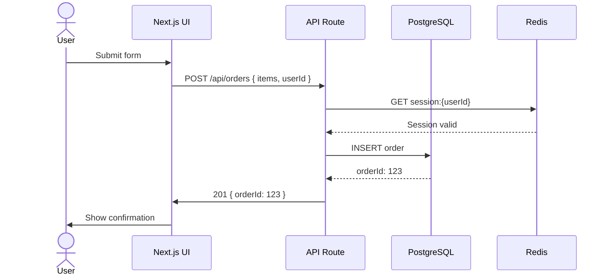

# API Documentation 2026

> Analyse code → extract contracts → generate docs → output structured markdown.
> Produces README, API reference, JSDoc/TSDoc annotations, and architecture diagrams
> from source files without requiring external tools.

---

## TRIGGER

This skill is activated by:
- `/doc [file-or-directory]` command
- "document this", "generate docs", "write a README", "API reference for…"
- "explain the architecture of…"

---

## STEP 1 — ANALYSE THE TARGET

### For a single file

```javascript
// Read and parse the file
const source = await read_file(targetPath);

// Extract:
// 1. Exported functions/classes/types
// 2. Function signatures (name, params, return type)
// 3. Existing JSDoc/TSDoc comments
// 4. Side effects (DB calls, API calls, mutations)
// 5. Error conditions (thrown errors, rejected promises)
```

### For a directory

```bash
# Get the file tree first
find ./src -name "*.ts" -o -name "*.tsx" -o -name "*.js" | sort

# Read key files: index files first, then by depth
# index.ts / index.js → exports → implementation files
```

---

## STEP 2 — CHOOSE DOCUMENTATION TYPE

| Requested | Output format |
|-----------|---------------|
| "README" | README.md with overview, install, usage, examples |
| "API reference" | Per-function/class markdown reference |
| "Architecture diagram" | Mermaid diagram + text description |
| "JSDoc / TSDoc" | Inline annotations added to source |
| "/doc" (unspecified) | README + API reference |

---

## STEP 3A — README GENERATION

```markdown
<!-- Template: README.md -->
# {Package / Component Name}

> {One-sentence description of what it does and why it exists.}

## Installation

```bash
npm install {package}
# or
pnpm add {package}
```

## Quick Start

```typescript
import { {MainExport} } from '{package}';

// Minimal working example
const result = await {MainExport}({
  {requiredParam}: 'value',
});
console.log(result);
```

## Usage

### {Use case 1}

```typescript
// Annotated example with context
```

### {Use case 2}

```typescript
// …
```

## API Reference

See [API.md](./API.md) for the full reference.

| Function | Description |
|----------|-------------|
| `{name}(params)` | {one-line description} |

## Configuration

| Option | Type | Default | Description |
|--------|------|---------|-------------|
| `{option}` | `{type}` | `{default}` | {description} |

## Error Handling

```typescript
try {
  await {MainExport}(params);
} catch (err) {
  if (err instanceof {SpecificError}) {
    // handle …
  }
}
```

## Browser / Node Compatibility

{Table or list of supported environments}

## Changelog

See [CHANGELOG.md](./CHANGELOG.md).

## License

{LICENSE}
```

---

## STEP 3B — API REFERENCE GENERATION

For each exported function, class, or type, generate a documentation block:

```markdown
<!-- Per-function template -->

### `functionName(param1, param2?, options?)`

{One-sentence description. What it does, not how.}

**Parameters**

| Name | Type | Required | Default | Description |
|------|------|----------|---------|-------------|
| `param1` | `string` | ✅ | — | {description} |
| `param2` | `number` | ❌ | `0` | {description} |
| `options.timeout` | `number` | ❌ | `5000` | Request timeout in ms |

**Returns**

`Promise<{ReturnType}>` — {description of return value}

**Throws**

| Error | Condition |
|-------|-----------|
| `ValidationError` | When `param1` is empty |
| `NetworkError` | When the upstream API is unreachable |

**Example**

```typescript
const result = await functionName('input', 42, { timeout: 3000 });
// result: { id: 'abc', status: 'ok' }
```

**Notes / Side effects**
- Makes a POST request to `/api/endpoint`
- Mutates the global cache on success
- Rate-limited to 10 calls per minute

---
```

---

## STEP 3C — ARCHITECTURE DIAGRAM (Mermaid)

Generate a Mermaid diagram alongside a text description:

```markdown
## Architecture

### Component Diagram

```mermaid
graph TD
    A[Browser / Client] -->|HTTPS| B[Next.js App Router]
    B --> C[API Routes]
    C --> D[(PostgreSQL)]
    C --> E[Redis Cache]
    C --> F[Stripe API]
    B --> G[Static Assets / CDN]
    C --> H[Email Service]

    style A fill:var(--surface),stroke:var(--border)
    style D fill:var(--surface-up),stroke:var(--accent)
```

### Data Flow: {Key User Journey}



### Directory Structure

```
src/
├── app/                    # Next.js App Router
│   ├── (auth)/             # Auth route group
│   ├── api/                # API routes
│   └── layout.tsx          # Root layout
├── components/
│   ├── ui/                 # Design system primitives
│   └── features/           # Feature-specific components
├── lib/
│   ├── db.ts               # Database client
│   ├── auth.ts             # Auth utilities
│   └── api/                # API client functions
├── hooks/                  # Shared React hooks
├── types/                  # TypeScript interfaces
└── tokens.css              # Design system tokens
```
```

---

## STEP 3D — JSDOC / TSDOC ANNOTATION

Add inline documentation to existing source files:

```typescript
/**
 * Calculates the total price of an order including tax and discounts.
 *
 * @param items - Array of line items with price and quantity.
 * @param options - Optional configuration.
 * @param options.taxRate - Tax rate as a decimal (e.g., 0.2 for 20%). Default: 0.
 * @param options.discountCode - Promo code to apply. Validated server-side.
 * @returns The calculated order total in the smallest currency unit (pence/cents).
 *
 * @throws {ValidationError} If `items` is empty or contains negative prices.
 * @throws {InvalidDiscountError} If `discountCode` does not exist or is expired.
 *
 * @example
 * const total = await calculateOrderTotal(
 *   [{ productId: '1', price: 1000, quantity: 2 }],
 *   { taxRate: 0.20, discountCode: 'SAVE10' }
 * );
 * // total: 2160  (2000 - 200 discount + 360 tax)
 */
export async function calculateOrderTotal(
  items:   OrderItem[],
  options: { taxRate?: number; discountCode?: string } = {}
): Promise<number> {
  // implementation
}
```

---

## STEP 4 — DOCUMENTATION QUALITY CHECKLIST

Before outputting any documentation, verify:

```markdown
- [ ] Every exported function is documented (no undocumented exports)
- [ ] All parameters have type, required/optional, default, and description
- [ ] At least one working code example per function
- [ ] Error conditions explicitly listed
- [ ] Side effects (network calls, mutations, cache) documented
- [ ] Architecture diagram includes all external dependencies
- [ ] README has: install, quick start, API reference link
- [ ] No implementation details in public docs (what, not how)
- [ ] Version number or "Last updated" date included
- [ ] Links between documents are relative (not absolute URLs)
```

---

## STEP 5 — OUTPUT FORMAT

Produce separate files for each documentation type:

```
docs/
├── README.md               ← project overview + quick start
├── API.md                  ← full API reference
├── ARCHITECTURE.md         ← diagrams + structure
└── CHANGELOG.md            ← version history (if updating)
```

Or inline JSDoc/TSDoc directly in source files if `--inline` mode is requested.

---

## DOCUMENTATION STANDARDS

| Rule | Rationale |
|------|-----------|
| Describe **what**, not **how** | Implementation changes; interface shouldn't |
| One example per function minimum | Docs without examples are unusable |
| Document the error surface | Most bugs come from unhandled edge cases |
| Keep examples runnable | Copy-paste should work without modification |
| Update docs in the same PR as code | Stale docs are worse than no docs |
| Use consistent tense (imperative: "Returns", not "Will return") | Readability |
