# UI/UX User Flow Diagrams

> Generate Mermaid user flow diagrams from natural language descriptions.
> Visualize user journeys, conversion funnels, and navigation paths.

---

## OVERVIEW

This skill converts natural language descriptions into Mermaid flowchart diagrams. Use it to:
- Document user journeys before implementation
- Visualize conversion funnels
- Plan navigation architecture
- Communicate flows to stakeholders

---

## INPUT FORMAT

Describe the flow in plain language:
- Use `→` or "then" to indicate sequence
- Use `|` or "or" to indicate branches
- Use `(condition)` to indicate decision points

### Examples

```
"checkout: cart → address → payment → confirmation"
"login: email → (valid?) → dashboard | error"
"onboarding: welcome → profile → preferences → complete"
```

---

## OUTPUT FORMAT

### Standard Flow (Mermaid)

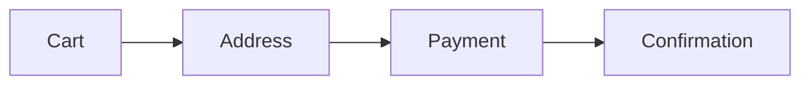

### Flow with Decisions

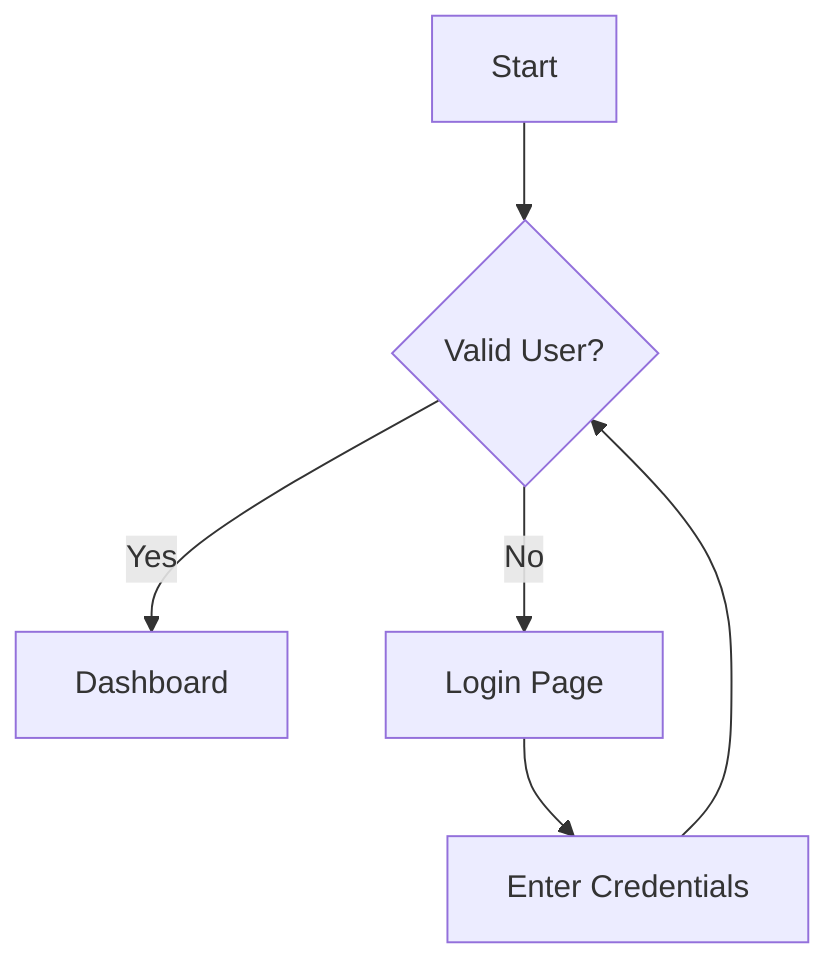

---

## FLOW PATTERNS

### 1. Linear Flow (Checkout)

**Input**: "checkout: cart → shipping → payment → review → confirmation"

**Output**:
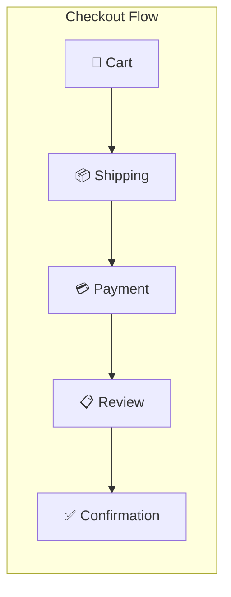

### 2. Branching Flow (Authentication)

**Input**: "auth: login page → (has account?) → sign in form | sign up form → (valid?) → dashboard | show error"

**Output**:
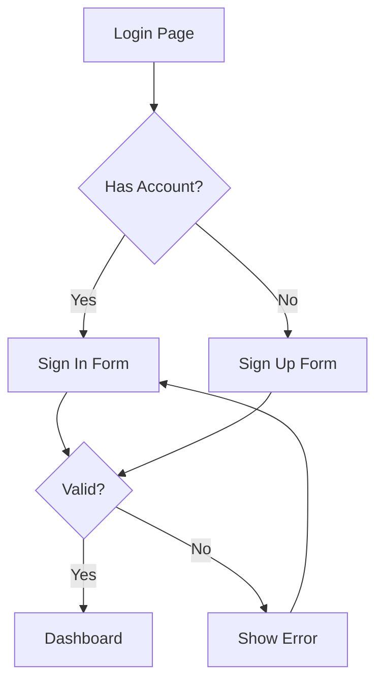

### 3. Multi-Step Form (Onboarding)

**Input**: "onboarding: welcome → personal info → company → team invite → complete"

**Output**:
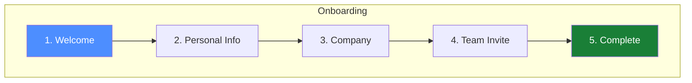

### 4. E-commerce User Journey

**Input**: "shopping: browse → product page → add to cart → (logged in?) → checkout | login → checkout → payment → order complete"

**Output**:
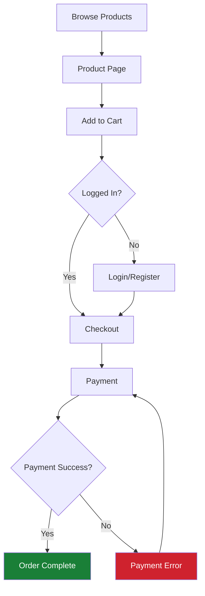

### 5. Error Handling Flow

**Input**: "form submission: fill form → validate → (valid?) → submit → (success?) → success page | retry | show errors → fill form"

**Output**:
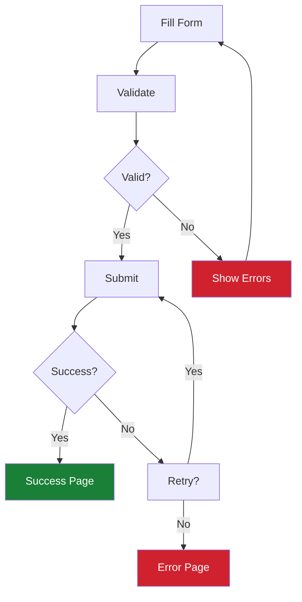

### 6. SaaS Subscription Flow

**Input**: "subscription: pricing page → select plan → (has account?) → create account | sign in → payment → (trial?) → start trial | activate → dashboard"

**Output**:
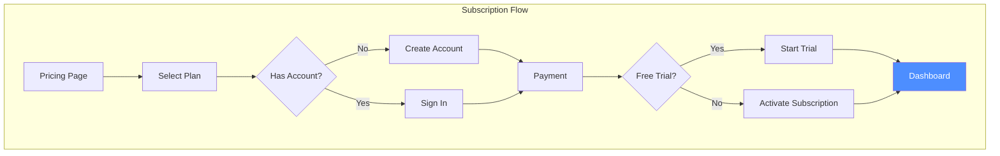

---

## GENERATION RULES

1. **Start nodes**: Use rectangle `[text]`
2. **Decision points**: Use diamond `{question?}`
3. **End states**: Style with success/error colors
4. **Grouping**: Use `subgraph` for related steps
5. **Direction**: 
   - `LR` (left-right) for linear flows
   - `TD` (top-down) for branching flows

### Node Shapes

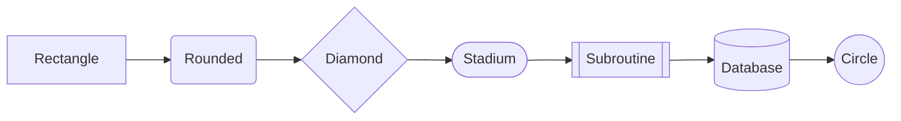

### Styling

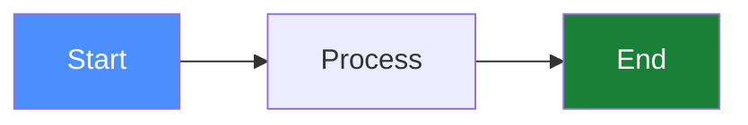

---

## CONVERSION FUNNEL EXAMPLE

**Input**: "funnel: landing page (1000) → sign up (300) → verify email (250) → complete profile (150) → first purchase (50)"

**Output**:
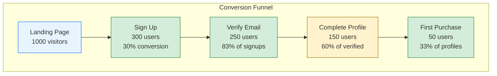

---

## MOBILE APP NAVIGATION

**Input**: "app navigation: splash → (logged in?) → home | onboarding → home → [products, cart, profile, settings]"

**Output**:
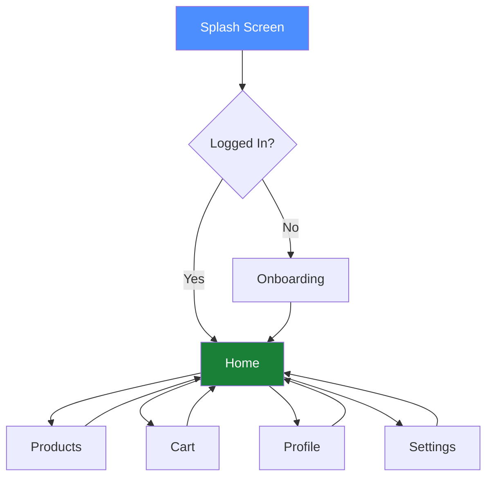

---

## AI PROMPT TEMPLATE

When the user asks to create a user flow, use this template:

```
Based on your description: "{user_input}"

I'll generate a Mermaid flowchart diagram. Here's the visualization:

[Mermaid code block]

**Flow Summary:**
- Entry point: {first_step}
- Decision points: {list_decisions}
- End states: {list_outcomes}
- Total steps: {count}

Would you like me to:
1. Add more detail to any step?
2. Include error handling?
3. Show mobile vs desktop variations?
4. Add metrics/conversion rates?
```
